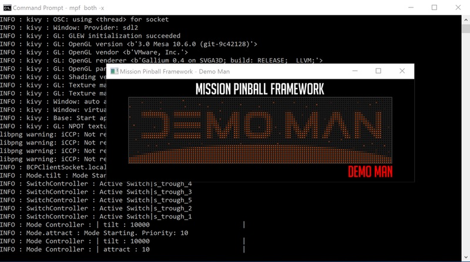

# How to run "Demo Man", an MPF example game

One of the development machines we have for MPF is a 1994 Williams
*Demolition Man*, and we have a simple MPF configuration built for it
that you can run to see MPF in action.

Even if you don't have a physical *Demolition Man* machine (which we
assume you don't), you can run our "Demo Man" config using MPF's
[smart virtual](../hardware/virtual/smart_virtual.md) platform.

## 1. Download the MPF examples bundle

Instructions [here](mpf-examples.md).

## 2. Run *Demo Man*, a sample game that comes with MPF

Open a command prompt (like you did when you installed MPF) and switch
to the folder where you unzipped the mpf-examples ZIP file, then change
to the `demo_man` folder and run:

    mpf both -X

(Note that's an uppercase "X")

The `mpf both` command launches both the MPF game engine and media
controller at the same time, the `-X` command line option tells MPF to
use the "Smart Virtual" platform (instead of the P-ROC platform that
the Demo Man files are configured for) since you most likely don't have
a Demolition Man machine connected to your computer right now.

You should see a bunch of stuff scroll by and a pop up window which
shows the Demo Man DMD, like this:

If you don't see the DMD window pop up, make sure it isn't hiding
behind another window.

## 3. "Play" your first game

Since you don't have physical hardware attached, you can use the
keyboard to simulate machine switch changes.

The *Demo Man* configuration files have the "S" key mapped to start,
so if you click in the graphical window with the DMD in it (to give it
focus) and push the `S` key, then you should see the DMD attract mode
stop and it change to a score screen showing a score of *00* and *BALL 1
FREE PLAY*:

If your speakers are on you should also hear a music loop playing.
(Depending on your system, you might not hear the music when the DMD
window doesn't have focus.)

At this point you can "play" the game via your keyboard. Hit the `L`
key to launch the ball into play. You should hear the music loop change
to the main background music.

You can hit the `X` key to simulate the left slingshot hit which should
play a sound effect on top of the music as well as show a score. You can
hit the `1` key to simulate the ball draining and entering the trough.
Then you can hit the `L` key again to launch the ball into play again.
You can also press the `S` key additional times during Ball 1 to add
additional players.

When you play through a complete game (3 balls per player), the machine
should go back into attract mode (or possibly the high score entry
mode).

You can quit the game by making sure the *Demo Man* popup window is in
focus and hitting the *Esc* key.

To summarize the instructions for "playing" a game from the paragraphs
above:

1.  Launch both the MPF core engine and the media controller and make
    sure you see the the popup graphical window with the DMD in it.
2.  Click the mouse into the DMD window so that it has "focus"
3.  Press the `S` key to start a game. You should hear the music loop
    start.
4.  Press the `L` key to launch a ball into play. You should her the
    music switch to the main background theme for the game.
5.  Press the `X` key a few times to simulate hitting the left
    slingshot. You should see the score change each time you do this.
6.  Press the `1` key to drain the ball.
7.  Repeat Steps 4-6 until you finish your game or get bored.
8.  If you get a high score, the `Z` and `/` keys are mapped to the left
    and right flipper buttons to highlight a letter, and the `S` key
    (start) selects it.
9.  Press the `Esc` key to exit

## What if it did not work?

In the following we list some common problems and solutions. If you got
another problem please ask in our [forum](../community/index.md).

### Keyboard does not work

If your keyboard does not work first make sure that the MC window has
focus. Afterward, please check if numlock is enabled. This seems to be
common issue on Windows 10. Disable numlock in this case.

### Game does not start errors

**Version mismatch** - Make sure you are using the exact version of
demo_man for your MPF, MPF-MC and MPF monitor (optional). For instance
use `0.30.x` if you are on MPF `0.30.2`. MPF-MC and (if installed) MPF
monitor need to have the same major version (`0.30` in this case). You
can check installed versions using `pip3 list`.

**FT_ListDevices(2) or WARNING : P-Roc : Failed to instantiate
pinproc.PinPROC(3) error** - By default the Demo Man example expects to
be connected to P-Roc hardware. If you see this you probably forgot to
add the `-X` switch to your `mpf both` command which tells MPF to
override the hardware setting to the Smart Virtual platform. This
sometimes happens when trying to debug another error and you follow the
guide about verbose logging using the `-v -V` switches.
