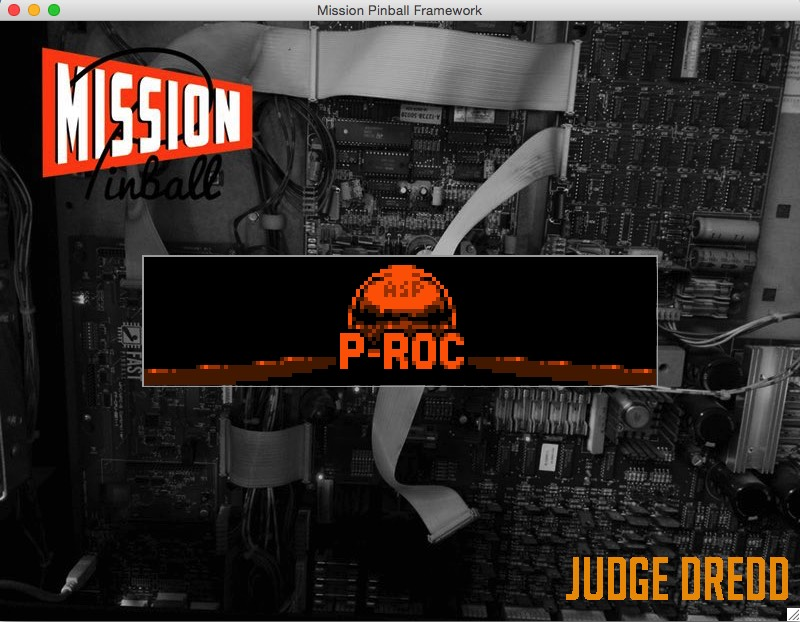

# Types of Displays

Every electronic pinball machine has some type of display, whether it's
1980s-style 7-segment numeric displays, an early '90s-style
alphanumeric display, a mono dot matrix display (DMD), a full color
"RGB" DMD, or a modern LCD (which itself can either be a small LCD,
like a "color DMD", or a huge one like what Jersey Jack has in the
backbox of The Wizard of Oz and The Hobbit).

The MPF media controller is designed so that it can support all types of
these displays, including multiple different types of displays at the
same time. It supports text, drawing shapes, images, and videos. You can
position any combination of these on the display at any time, and you
can set layering and transparencies. You can use standard TrueType
fonts. You can also apply animations, motions, and transitions to your
displays and their widgets. And, like just everything else in MPF, you
can do most of your display configuration via the config files.

!!! note

    Everything in this "Displays & Graphics" section is about the default
    MPF Media Controller. See the
    [media controller](mc) section for
    details and alternative implementations.

Here are a few photos of the MPF Media Controller's display system in
action. These were all created with configuration files and without
manual programming.

Here's a traditional
[single-color / mono DMD](dmd.md):

Here's an on-screen window (or what many people called an "LCD"
display. In this case, it's showing on single
[color DMD](rgb_dmd.md) virtually
with no "dot" filter applied, along with other on-screen content:

Here's a "color" DMD on an LCD monitor. It's showing a 128x32 window
of color content, with a "dot look" filter to make it look like dots.

Here's a full-size window with the dot filter applied:

Here's a full-color RGB DMD LED matrix. (So it's like a color DMD, but
a matrix of 2.5mm RGB LEDs rather than an LCD):

Before we go into the details of all the various display components,
let's start with an overview of how the MPF display architecture works.
(If you don't care about the details and just want to start using your
display, you can jump directly into our
[step-by-step tutorial](../../tutorial/index.md)
which covers how to get your display running.)

Additionally, MPF also supports
[segment displays and alpha numeric displays](alpha_numeric.md). Both physically and virtually. Another type of displays are
[score reels](../../mechs/score_reels.md)
which can also be controlled.

## Related Events

* [display_(name)_initialized](../../events/display_display_initialized.md)
* [display_(name)_ready](../../events/display_display_ready.md)

* [Concepts & Architecture](architecture.md)
* [Slides](../slides/index.md)
* [Widgets](../widgets/index.md)
* [Media Controller](../index.md)
