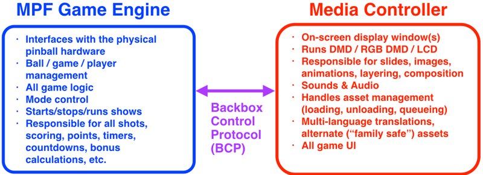

# MPF Media Controller(s)

The core MPF game engine does not handle graphics or audio. Instead, that is
handled by a completely separate program called a "media controller."

We have created a default media controller called "MPF-MC" (MPF Media Controller)
that is also based on Python and shares the same config files as MPF. However,
you don't have to use it. Many people have created their own media controllers
in other languages (Unity 3D, C#, Godot, Lua versions all exist), or you could
write your own.

The MPF game engine and media
controller talk to each other via something called "BCP" which is a
protocol we created for this purpose which stands for "Backbox Control
Protocol". (More details on BCP are available at the [MPF developer
site](http://developer.missionpinball.org).)

Here's a diagram that shows what each piece does:

Why are the MPF game engine and media controller two separate processes?
Two reasons:

First, having two processes means that each one can run on a separate
core in a multi-core host computer. This makes efficient use of hardware
since the trend is to have multiple cores. If the game engine and media
controller were combined, then your quad-core Raspberry Pi 3 would have
all the MPF stuff running on one core while the other three cores were
wasted doing nothing.

Second, having two processes means you can replace MPF's default media
controller with something else if you want different features. For
example, there is a group of people building an open source
[Unity 3D-based media controller](unity_bcp_server.md) which can be used for very advanced 3D display graphics.
