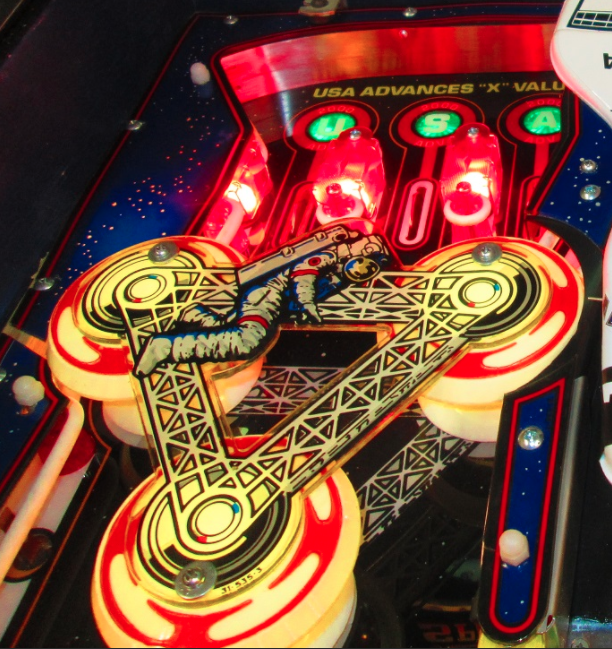
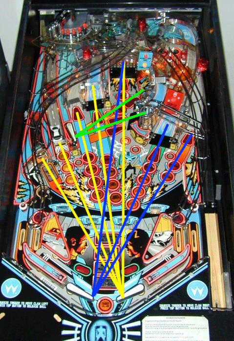

# What Should You Consider When Planning a Playfield Layout?

In general, it is a good idea if you really played pinball before. You
need to get a feel for what is rewarding as a player and then you need
to understand how that works. For instance, where are the switches to
play the first sound when you hit the entrance of a shot? When and how
does the machine count the shot as successful?

Otherwise, you might end up with switches that when hit do absolutely
nothing. Not even a blinking light, score increment or a basic sound
effect because it does not make sense at that point. Anyone who had
played even a little pinball would've known what people were expecting.
As you observe and play more pinball, you get a knack for what types of
things will really immerse the player, and can then incorporate them
into your own games.

Some notes from people in our community
([please tell](../about/help_docs.md) us if you have more):

## Pop Bumpers

Pop bumpers are great for randomizing the action of the ball. They can
also offer the player a bit of pause to consider where the ball is
coming from. When designing your pop bumper area, it's generally good
advice to have rubber surrounding the area to keep the ball action high.

Surrounding pop bumpers with steel (like ball guides, for instance) is a
quick way to kill the action (and the fun).

Below is a picture of pop bumpers surrounded by steel, with large gaps
to the lower playfield. Action here will be very limited:

Below is a picture of pop bumpers surrounded by rubber, with a defined
exit to the lower playfield. Action here will be very high:

## Upper Flippers

Upper flippers are a great way to add a second dimension to the shot
flow of a game. For example, if you have an upper right flipper, you can
incorporate shots on the middle/upper left of the playfield behind other
objects. These are generally harder shots on their own. With that said,
you should at least have a feed to the upper flipper (from a ramp, an
orbit, or some other shot). Generally its a good idea to make the access
to the flipper easier, because the shots off of the flipper will be more
difficult.

## Inserts

Make sure each shot has dedicated inserts so that you can indicate what
you want the player to shoot. RGB arrow inserts are great for denoting
shots to the player (you can color code them) and you don't have to put
text over the arrow. Lower inserts will generally be "mode specific".
You can look at the ramp/orbit shots on Demolition Man to get an idea
for the insert layout. The arrows are generic, everything else is
specific.

## Ball Guides and Posts

The ball should never ever ever hit metal directly unless its a ball
guide. Even then, the end of the ball guide should have a rubber post
(positioned such that the edge of the guide is covered, but a ball
rolling down the guide wont hit it and have its trajectory altered). (I
knew this and still managed to screw it up on Wizard Blocks as several
shots immediately hit the lane guides or metal ramps. It causes the
whole game to play like a big clunky metal piece of garbage.)

Also, when positioning ball guides for an orbit shot, it is generally a
pleasing experience to the player to have the ball come off the orbit
right toward the flipper. Some designs have placed orbits such that they
hit the tip of the slingshot and bounce the ball out of control. This
makes for a more difficult game, and if orbit shots are key to certain
modes, this could be rather frustrating for a player who's trying to
control the ball.

## Shot Lines

It goes without saying that any shot you place on a playfield should be
makeable from one or multiple flippers. Fan layouts are a common
occurence in playfield design (think of No Fear or Monster Bash),
typically arranged into a fan of 7 or 8 shots.

If you find yourself doing more asymmetric playfield designs, you should
pay special attention to make sure that the shots are makeable. You can
draw shot lines from the flippers to measure this.

Every shot from the flipper generally leaves in a straight line. Take
your playfield CAD/Drawing/etc and see if you can draw a straight line
up the playfield to the shot you're testing. Be sure to account for
half the diameter of the ball to make sure a collision with another
object won't throw the ball off course.

Shot lines are also a great tool to see which shots are able to be back
handed off the flipper on the same side.

Here's an example of shot lines on Demolition Man:

## Anything missing?

Do you have more advice? Did you make a stupid mistake (in
retrospective) and want to tell other about it? Please
[contribute a section to this guide](../about/help_docs.md) or tell us in the [community forum](../community/index.md).
