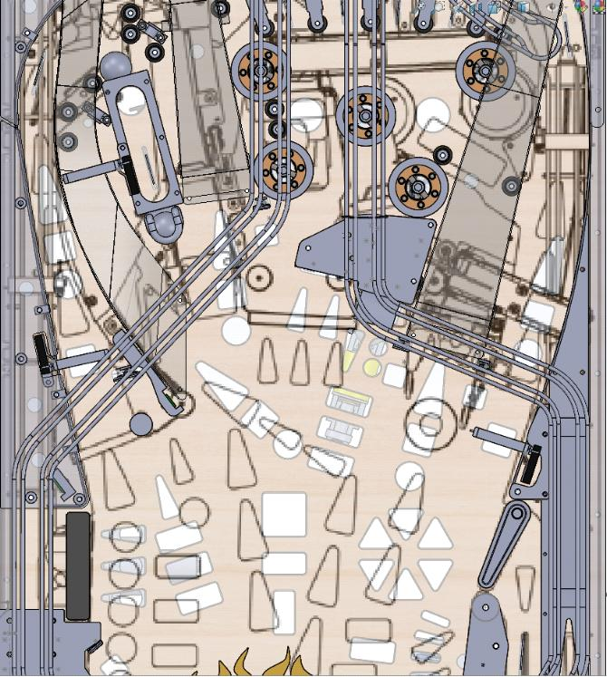
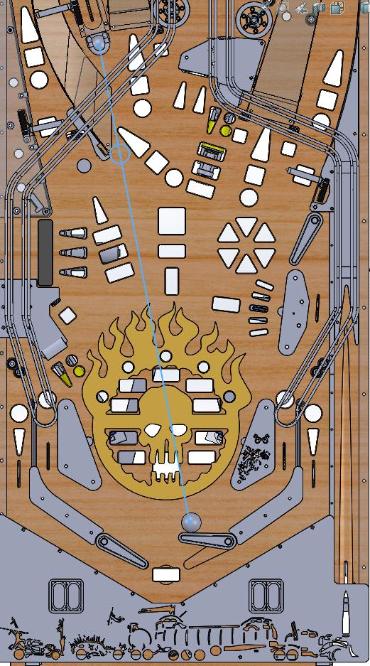
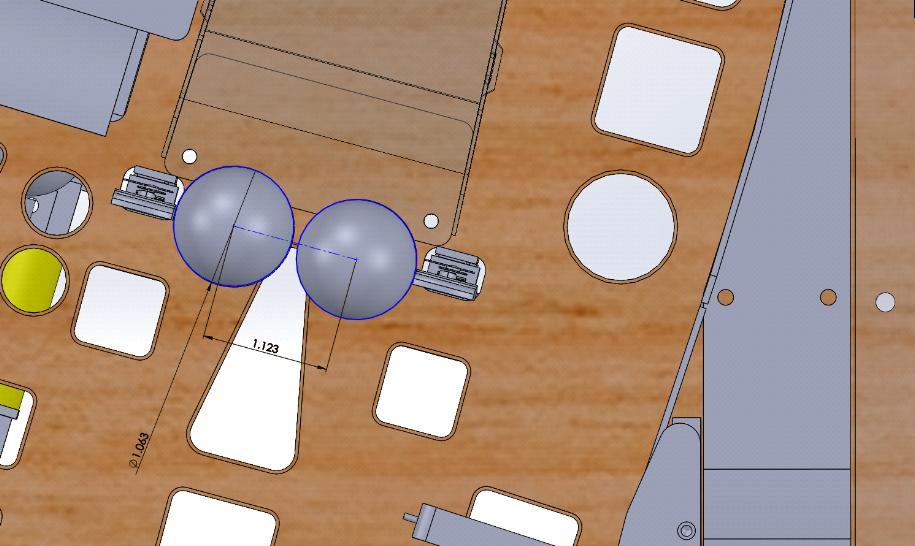
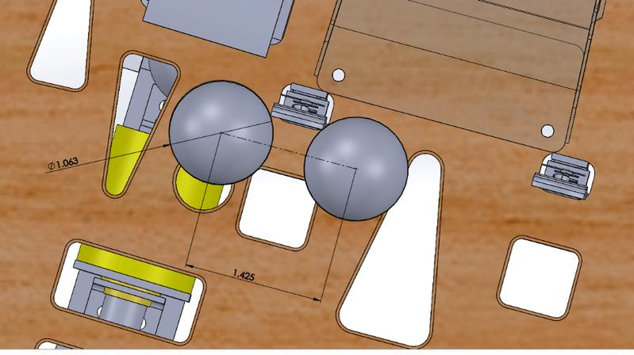

# Planning Layout with CAD

## Borrowing Shots With CAD

If you have planned shot in an area that matches an existing machine,
you can borrow/take their geometry. This way you know the geometry will
be good without any revisions. PDF's of instructions manuals for games
are a good source for the flat overhead pic you will need.
[IPDB.org](https://www.ipdb.org) is one good source for these.

Most CAD programs have a function to overlay an image file directly onto
your model. Search youtube for "How to overlay image" + your CAD
system.

You will have to move and skew the image until the flippers and size
line up with your drawing. Once this is done you can take a shot with
confidence.

Here's an example of a Spiderman pinball overlay onto a homebrew
pinball machine to get the geometry of the Venom ramp shot:

## Using to CAD to Test/Plan Shots

You can draw a shot in CAD to see if it is makeable. Here is an example
of testing if a newton ball shot can be made from the right flipper:

Here we test where the balls will go coming of the orbit shots. (We left
a small straight line at the end/beginning of the orbit when designing,
then made the dotted lines parallel):

Here we use CAD to see how a ball lock will exit when hit with a trapped
newton ball:

Here we use CAD to see if balls wil get trapped after the ball lock:

Subtract the ball diameter (1.0625") from ramp and lane shots to see
their actual width.

Here you can see a .500" wide mini target is easier to hit than an over
2" wide ramp.

