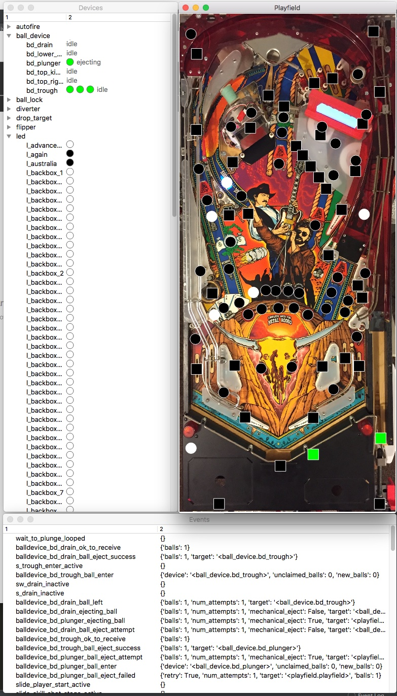

# The MPF Monitor

The MPF monitor is a graphical app that connects to a live running
instance of MPF and shows the status of various devices. (LEDs,
switches, ball locks, etc.) as well as a running list of recent
[MPF events](../../events/index.md). You can add
a picture of your playfield and drag-and-drop devices to their proper
locations so you can interact with your machine when you're not near
your physical machine and/or for developing your game. MPF Monitor is
also great when you have more than one person working on your MPF code
but your physical machine is at one person's house. :)

The MPF Monitor can run on Windows, Mac, and Linux. It uses
[PyQt6](https://www.riverbankcomputing.com/software/pyqt/intro) (Python
bindings for Qt6) for its visual framework.

Here's a screen shot of it in action:

!!! note

    The MPF Monitor is *not* a full pinball simulation with physics or
    moving balls or anything. But it does enough that you can use it to do
    real work on a machine when that machine is not nearby.

Video about developing your game without hardware:

<iframe width="560" height="315" src="https://www.youtube.com/embed/7XmIIhzEREk" title="YouTube video player" frameborder="0" allow="accelerometer; autoplay; clipboard-write; encrypted-media; gyroscope; picture-in-picture" allowfullscreen></iframe>

## Features

* Connects to a live running instance of MPF.

* Automatically discovers all the pinball mechs and devices in the
    game.

* Device state is updated in real time in the "Devices" window.

* MPF events and their keyword arguments are posted in real time to
    "Events" window.

* You can add a photo of your playfield and then drag-and-drop LEDs,
    lights, and switches from the device tree onto the playfield.

    * LEDs (circle icons) show their color in real time.
    * Lights (circle icons) show their brightness in real time
        between black and white.
    * Switches (square icons) show their state (green = active,
        black = inactive).
    * More device types will become "draggable" in the future.

* Left-click on a switch to "tap" it (activate & release).
    Right-click on a switch to "toggle" it (change its state and hold
    it).

* Devices added to the playfield image are saved & restored when you
    restart the monitor.

* Window sizes, positions, and which windows are open are remembered
    and restored on next use.

* You can start the monitor and leave it running, and it will
    automatically connect (and disconnect/reconnect) to MPF as MPF
    starts and stops.

## Road Map Features

MPF Monitor is *very* rough at this point. (Really more of a
proof-of-concept.) We plan to add more features, including:

* More details for events, including listing registered handlers &
    making it so you can sort, search, and clear the list.
* Adding all the "game logic" stuff, including modes, shots, shot
    groups, shot profiles, logic blocks, timers, ball locks, multiballs,
    achievements, etc.
* Add shows (running shows, step they're on, priority, etc.)
* Add players information (show all player variables and their values)
* A "snapshot" button that can dump the entire current state to a
    file for debugging later
* Export position (x/y) settings of widgets back to the MPF config
* Connect to MPF-MC to get information about slides, displays,
    widgets, etc.
* Add color controls to the playfield image to set brightness and
    color saturation
* Add buttons to enable/disable different types of devices (think of
    it like "layers" for the playfield image.
* Show additional properties from the selected device (Click a device
    to see it's full information.)
* Change debug levels of various devices dynamically
* Save the config / layout with a specified file name
* Add multiple playfield views which could each have different devices
* Set colors, shapes, rotation, & sizes of devices (so inserts can be
    the right shape). Allow configurable "off" colors which can
    include opacity and "glow" so inserts look like real lights.
* Allow all devices to be added to the playfield image, with custom
    representation (diverters that animate, flippers that animate,
    etc.).
* Device state change history that shows what properties changed and
    when.
* Default (mostly blank) playfield image if no playfield image is
    specified
* Configurable default options (folder location, playfield image name,
    etc.)

## Next Steps

[installation](installation.md)
[running](running.md)
[devices-and-using](devices-and-using.md)
