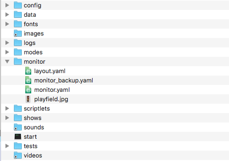

# Running the MPF Monitor

1.  Make sure you installed MPF Monitor first. (You need to actually
    [run the installer](installation.md).
    You can't just run the monitor from the download folder.)
2.  Create a subfolder in your MPF machine folder called `/monitor`
3.  Put an image of your playfield in that folder named `playfield.jpg`
4.  Run MPF monitor from a command prompt via the command `mpf monitor`.
    Be sure to run this from your machine folder (the same place where
    you run `mpf both`).
5.  In a new terminal window, Start MPF and MPF-MC. You can start MPF
    before or after monitor is started, and leave the monitor running
    while MPF is not.
6.  MPF Monitor has multiple windows that can be viewed, though not all
    may be enabled by default. The "Inspector" window is the main
    window where you can toggle other windows On and Off. To enable
    different windows, click on the "Monitor" tab. This will show you
    a list of all the different windows you can enable and view:
    1.  Show device window (this window lists all your switches, shots,
        targets, etc)
    2.  Show event window
    3.  Show playfield window (this window shows your playfield picture)
    4.  Show mode window
7.  MPF Monitor should connect to MPF and populate the devices tree in
    the device window. You can look through this list to see the states
    of various devices. The columns in each window are sortable and
    resizeable.
8.  You can drag-and-drop switches and LEDs from the Devices window onto
    the playfield image. When you do this, a config file called
    `/monitor/monitor.yaml` will be created. If you open that file,
    you'll see that x/y values of devices are stored in percentages
    instead of pixels, so they should stay in the right place even if
    you change your playfield image. The file is updated automatically.
    You can drag devices that you previously placed on the playfield too
    (there's a half-second delay so you don't accidentally move
    something when you're clicking on it).
9.  Edit `monitor.yaml` to remove devices from the playfield you don't
    want anymore.
10. When you resize or reposition one of the monitor windows, the window
    positioning information will be stored, so the monitor can restore
    the layout the next time you run it.

## Understanding MPF Monitor folders & files

Here's what your machine folder structure will look like when you're
using the monitor:

## Using the MPF Monitor

We designed MPF Monitor so that all the windows are separate (instead of
a main "parent" window), meaning you can resize them all however you
want and close the ones you don't need. The idea is that you can keep
the monitor running off to the side and still see your MPF display
window as well as the terminal windows, like this:

## Running with "virtual" hardware

You can use the MPF Monitor with or without a physical machine attached.

If you have a physical machine connected, be careful when toggling
switches, since it can really confuse things if a ball is sitting on a
switch in your machine and then you use the Monitor to tell MPF that the
ball isn't really there. :)

Still though it's nice to be able to "peek inside" the inner workings
of MPF even when it's connected to a physical machine, and the Monitor
is great for that.

You can also use MPF Monitor with no hardware attached using one of
MPF's [virtual platforms](../../hardware/virtual/index.md). Specifically the
[smart virtual platform](../../hardware/virtual/smart_virtual.md) works great if you're using MPF without physical hardware.

## Modifying switches and lights on your playfield

More information on the usage of MPF Monitor (0.54+) can be found in
[Playfield Devices and Using Device Inspector](devices-and-using.md).
