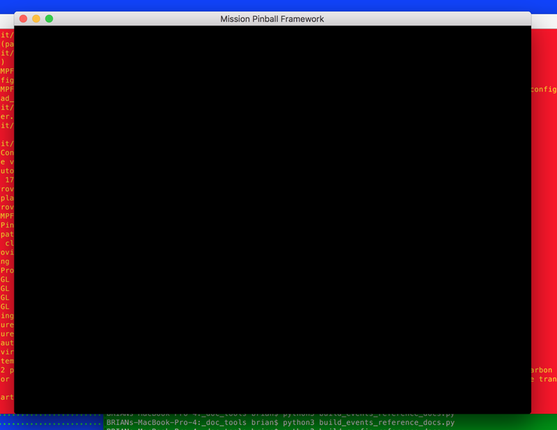
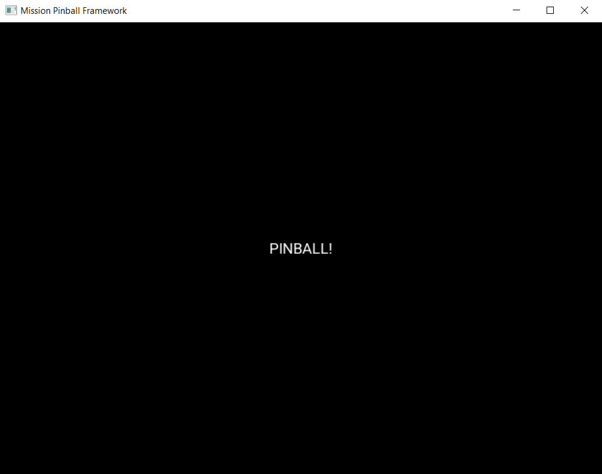
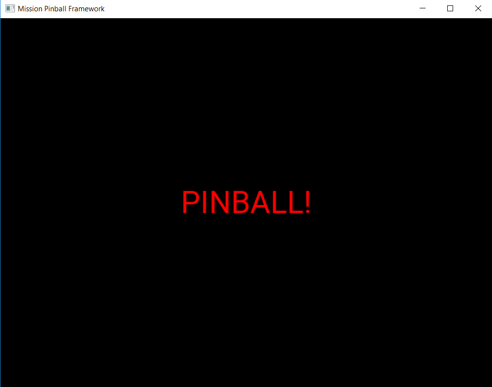
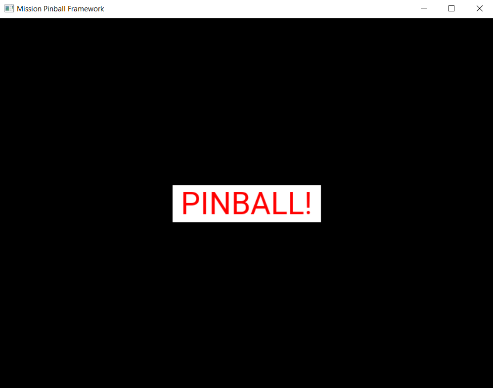
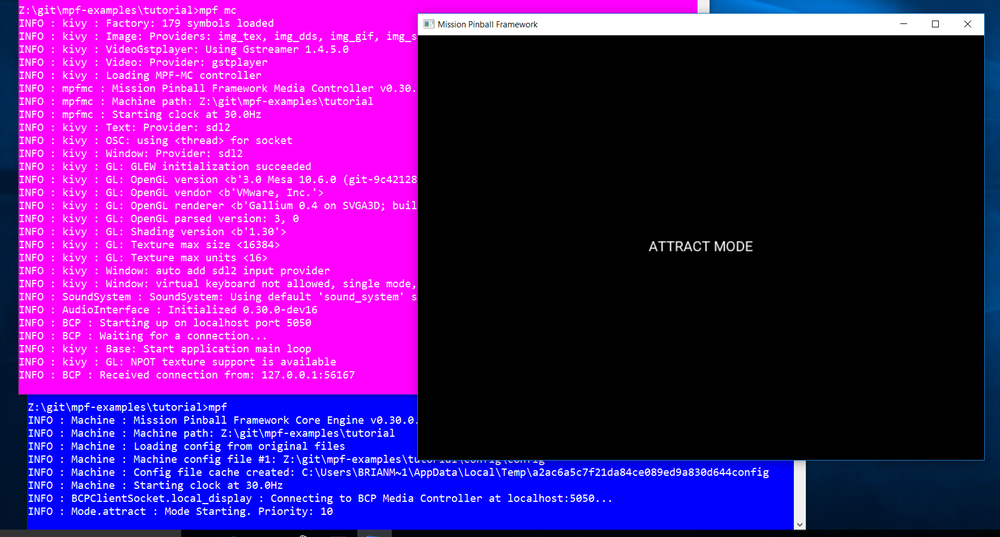
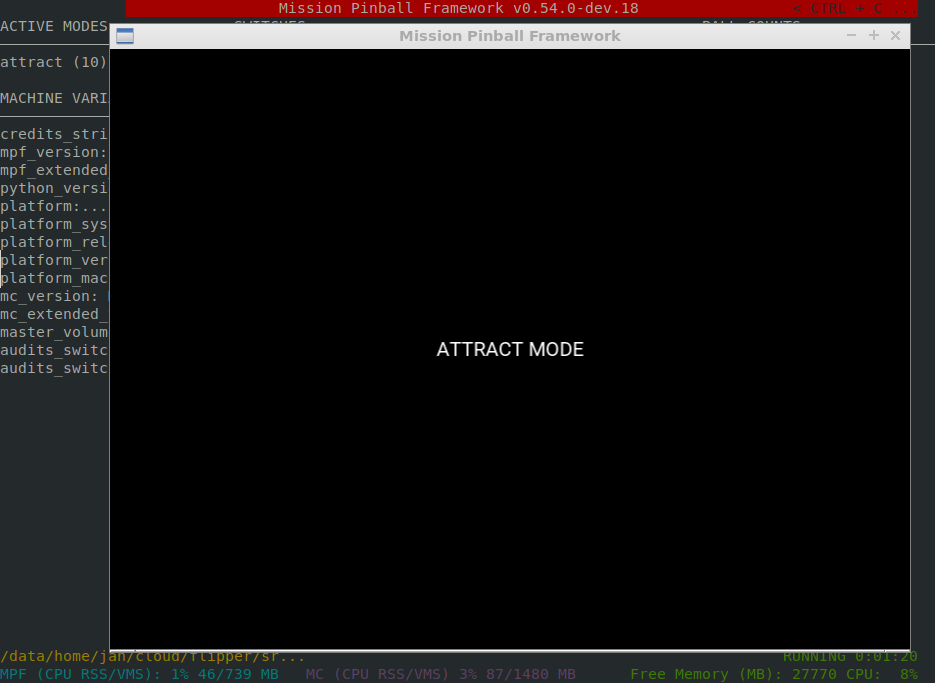

# Tutorial 5: Add a display

--8<-- "tutorial.md"

In this step, we're going to add a graphical on-screen window which
will help show what's happening in your machine as it runs. If you're
planning to put an LCD display in the backbox of your machine, this is
what we'll set up now. And if you want to use a physical DMD (whether
it's an older-style mono DMD, or a newer full color LED-based DMD),
you'll be able to use the screen window we set up in this step to show
a software version of your DMD. If you are looking to set up a Segment
or Alphanumeric display, follow this guide to set up them up:
[Alpha-Numeric / Segment Displays](../mc/displays/alpha_numeric.md)

Regardless of what type of display you want to use in your final
machine, follow this step in the tutorial and then you can set up your
final display later.

## 1. Run the media controller to see how it works

Remember from the MPF [MPF overview: How MPF works](../start/index.md)
section (you read that, right?) that MPF is actually two separate
pieces--the *game engine* and the *media controller*.

Up until this point in the tutorial, we've been running the MPF game
engine only. In this step, since we're adding a display, we'll be
working with the media controller.

So first, let's run the MPF media controller from your machine folder
so you can see how it works. You do that with the `mpf mc` command, like
this:

``` doscon
C:\pinball\your_machine>mpf mc
```

When you do this, you should see an 800x600 popup window that's
completely black with the title "Mission Pinball Framework". Here's
an example from Mac OS X:



You can close this window (and exit the MPF MC) by hitting the `Esc`
key. (If this doesn't work, click your mouse in the popup window to
give it focus and try again.)

You can also exit the MPF MC and close the popup window from the command
line via `CTRL+C`.

## 2. Add a "display" to your config file

Now that you know how to run the MPF media controller (or "MPF-MC", as
we often call it), let's configure your machine config so that window
actually shows some content.

The MPF game engine and MPF-MC both read the same configuration files,
so we'll be editing the same `config.yaml` file we've been working
with all along.

The first step is to create a "display" in your MPF config, which is
like an internal representation of a blank canvas that holds graphical
content which can be shown on an LCD screen or a DMD. The MPF-MC can
have multiple display canvases at the same time, and you can map
different ones to different physical displays. (This means ultimately
you can support multiple displays at the same time.)

The only setting for each display we need to worry about now is the
height and width, both defined in terms of the number of pixels. So for
now, create a single display called "window" set to 800x600 pixels. To
do this, add the following to your `config.yaml` file:

``` mpf-mc-config
displays:
  window:
    width: 800
    height: 600
##! test
#! advance_time_and_run .1
```

Make sure that the word `displays:` has no spaces in front of it, since
it's a top-level config item.

Note that in the example above, we used 2 spaces for the indentation
instead of 4. That's fine, YAML doesn't care. (And you can even
mix-and-match in the same file.) The only spacing thing that matters is
items at the same level are indented the same number of spaces (like
"width" and "height"). Also, no tabs.

The configuration above is creating a display called "window" which
MPF will automatically map to the on screen popup window. There are more
options here (especially when you get to using multiple displays)
covered in the [Displays, DMDs, & Graphics](../mc/index.md) section
of the documentation, but we don't need to worry about that.

Also, again, if your machine is going to use a physical DMD (whether
mono or color), or if you want to have the "dot look" of an on-screen
DMD on an LCD screen, for now just follow along the tutorial as is, and
then you can read full display documentation afterwards to configure
your displays. Everything we do in the tutorial will transfer over even
if you ultimately use a different kind of display.

## 3. Add a slide & a text widget

Ok, so now we have a display called "window". If you run `mpf mc`, you
will still see the black popup window (just like Step 2) since we
haven't actually told the window to show anything. So in this step,
we're going to add some content to the window display, starting with
some simple text.

To do this, you need to understand some basic concepts about how the
display system works in the MPF media controller.

Since the folks who originally started MPF spend a lot of time giving
presentations, the display concepts and terminology are pulled from
presentation software like Microsoft PowerPoint or Apple Keynote. So if
you're familiar with those, you should be familiar with the display
concepts in the MPF MC.

First is the concept of
[slides](../mc/slides/index.md). Just
like a PowerPoint presentation, an MPF display is essentially a window
frame that shows slides. Many slides can exist, but only one is shown at
a time, and that slide takes up the entire display. (Just like how a
PowerPoint slide takes up the whole display when you're playing the
slide show.)

In MPF-MC, when one slide switches to another, there can be an animated
"transition", like fade, push in, move out, etc.

A slide is like a blank canvas that you put things on. The "things",
in this case, are called
[widgets](../mc/widgets/index.md). MPF
has different types of widgets, for example, text, images, videos,
shapes, lines, etc. When you put a widget on a slide, you can specify
all sorts of properties, like the size, position, alignment, colors,
etc.

One slide can have lots of different widgets, and you can specify the
order widgets are drawn to control which ones are "on top" of others.
You can add and remove widgets from existing slides at any time, and you
can also animate widget properties, meaning you can change the opacity
(to make them flash), or you can animate their position, size, etc.

All of this will become more clear throughout the tutorial, so let's
just jump right in.

In order to show some text, we first have to create a slide, add a text
widget to that slide, and make that slide the active slide on the
display.

So first let's create the slide. There are several ways to do this, so
we're just going to show you one way here and then you can read the
full documentation on [slide](../mc/slides/index.md) later.

In MPF, all slides have names. You can define slides in the `slides:`
section of the config. So let's create a slide called
"welcome_slide", like this:

``` mpf-mc-config
slides:
  welcome_slide:
##! test
#! advance_time_and_run .1
```

Now let's add a `widgets:` section under that slide, then under that,
we'll start creating some widgets.

``` mpf-mc-config
slides:
  welcome_slide:
    widgets:
##! test
#! advance_time_and_run .1
```

You can add as many widgets as you want to a slide. (And it's pretty
common for slides to be made up of lots of widgets). For now let's add
a text widget that reads "PINBALL!". Do this by adding the following
to your config:

``` mpf-mc-config
slides:
  welcome_slide:
    widgets:
      - type: text
        text: PINBALL!
#! slide_player:
#!   show_slide_event: welcome_slide
##! test
#! post show_slide_event
#! advance_time_and_run .1
#! assert_slide_on_top welcome_slide
#! assert_text_on_top_slide PINBALL!
```

There are a few things going on there.

First, notice that before the word `type:`, there's a dash (hyphen),
followed by a space. This is how you specify a list of items in YAML.
(Think of it kind of like the YAML version of a bullet list.) You need
to do this when adding widgets to a slide since a single slide can have
more than one widget, so the dash tells the YAML file (and MPF-MC) where
the settings for one widget end and the next begin.

Second, the space AFTER the dash is important. WRONG: `-type: text`
RIGHT: `- type: text`

The `type: text` line is telling MPF-MC that this entry is for a text
widget. And the `text: PINBALL!` is setting the text for this widget to
be "PINBALL!". (For now we're just hard-coding the text to be
"PINBALL!", but in the future we'll look at how you can use
dynamically-updating text (like for the player score) that updates
automatically whenever it changes.

Now run `mpf mc` and what do you see?

A blank window again! :(

The reason the window is still empty is because even though we created a
slide (called "welcome_slide") and we added a widget to that slide, we
didn't actually configure MPF-MC to *show* that slide. So let's do
that now.

## 4. Add a slide_player config

Next, create a new section in your config called `slide_player:`. The
slide_player watches for certain events to occur, and when they do, it
"plays" a slide.

To see this in action, add the following section to your machine config:

``` mpf-mc-config
#! slides:
#!   welcome_slide:
#!     widgets:
#!       - type: text
#!         text: PINBALL!
slide_player:
  init_done: welcome_slide
##! test
#! advance_time_and_run .1
#! assert_slide_on_top welcome_slide
#! assert_text_on_top_slide PINBALL!
```

What this is doing is saying, "When the event called *init_done*
happens, play the slide called *welcome_slide*." The *init_done* is an
event that's posted by MPF-MC at the earliest possible point when it is
ready after it initially starts up (literally it's saying "the MC is
ready"). So what we're doing here is telling MPF-MC to show our
welcome slide as soon as it can. (Check out the
[events](../events/index.md) documentation for
details on what events are.)

To verify, run `mpf mc` again, and hopefully you see something like
this:



Cool! We have text! Of course it's kind of small, and white, but it
confirms that everything is working. Again, what's actually happening
here is:

* You have a display called "window",
* which is showing a slide called "welcome_slide",
* because the slide_player was configured to show that slide when the
    "init_done" event happened, and
* that slide has a single widget,
* which is a text widget with its text set to "PINBALL!".

There are lots of settings for each widget type that you can use in your
config file. Since this is a text widget, we can look at the
[documentation for text widgets](../mc/widgets/text/index.md) to see what options we have.

For example, let's change the font size and the color, by adding
`font_size:` and `color:` lines:

``` mpf-mc-config
slides:
  welcome_slide:
    widgets:
      - type: text
        text: PINBALL!
        font_size: 50
        color: red
#! slide_player:
#!   show_slide_event: welcome_slide
##! test
#! post show_slide_event
#! advance_time_and_run .1
#! assert_slide_on_top welcome_slide
#! assert_text_on_top_slide PINBALL!
```

Now when you run `mpf mc` again, you should see this:



By default, the widget is centered in the slide, but you can play with
different settings to position it wherever you want. (Check out
[How to position widgets on slides](../mc/widgets/positioning.md) for
details.)

## 5. Add a second widget

We already mentioned that you can add as many widgets as you want to a
slide and that there are lots of different kinds of widgets. Let's add
a second widget to your welcome slide. This one will be a rectangle
which appears behind the word "PINBALL!".

``` mpf-mc-config
slides:
  welcome_slide:
    widgets:
      - type: text
        text: PINBALL!
        font_size: 50
        color: red
      - type: rectangle
        width: 240
        height: 60
#! slide_player:
#!   show_slide_event: welcome_slide
##! test
#! post show_slide_event
#! advance_time_and_run .1
#! assert_slide_on_top welcome_slide
#! assert_text_on_top_slide PINBALL!
```

Again, note that you use a dash followed by a space to denote the start
of the second widget. This widget's type is "rectangle", with its
height and width specified. Since we're not specifying any position, it
will be centered (just like the text widget), and since we're not
specifying a color, it will be white.

Now when you run `mpf mc`, you should see this:



Note that the word "PINBALL!" is "on top" of the white rectangle.
That's because the order of the widgets on the display matches the
order they're entered into the config file. So in this example, since
the text widget comes first in the list of widgets for the welcome
slide, the text widget is on top. If you switch the order and run
`mpf mc` again, you'll just see the white rectangle with no text, since
the rectangle would be "on top" and it would completely cover the
PINBALL! text.

## 6. Run MPF-MC and the MPF game engine at the same time

Ok, so now you're able to run the media controller to get some widgets
to show up. But so far, you were just running `mpf mc` which is running
the media controller by itself, without the MPF game engine running.

So in this step, we're going to run them both at the same time.

The first thing you need to do is add another slide to your config for
the MC to play, and this time we'll make that slide play on a different
event.

So in your `slides:` section, add another slide called
`attract_started`, like this:

``` mpf-mc-config
slides:
  welcome_slide:
    widgets:
      - type: text
        text: PINBALL!
        font_size: 50
        color: red
      - type: rectangle
        width: 240
        height: 60
  attract_started:
    widgets:
      - text: ATTRACT MODE
        type: text
#! slide_player:
#!   show_slide_event: welcome_slide
##! test
#! post show_slide_event
#! advance_time_and_run .1
#! assert_slide_on_top welcome_slide
#! assert_text_on_top_slide PINBALL!
```

Note that `attract_started:` is indented the same number of spaces as
`welcome_slide:`. Also note that in the attract_started slide, we
switched the order of `text:` and `type:`. We did that here just to
demonstrate that the order of settings in the config doesn't matter.

If you run this, nothing different will happen because all we did here
in the slides section is define a slide. We need to use the
`slide_player:` section to actually play the slide when some event
happens.

So next, go to the `slide_player:` section of your config and add an
entry for the event `mode_attract_started`. (This is the event that is
posted whenever a mode starts, in the form of
*mode_<mode_name>_started*.)

By the way, if you're wondering how we know what events to use,
there's an [event reference](../events/index.md) in the documentation which has a list of all the events in
MPF as well as descriptions of when they're posted. You can use any of
these as triggers for your slides via the `slide_player:`.

Anyway, add the `mode_attract_started` to your `slide_player:` like
this:

``` mpf-mc-config
#! slides:
#!   welcome_slide:
#!     widgets:
#!       - type: text
#!         text: PINBALL!
#!         font_size: 50
#!         color: red
#!       - type: rectangle
#!         width: 240
#!         height: 60
#!   attract_started:
#!     widgets:
#!       - text: ATTRACT MODE
#!         type: text
slide_player:
  init_done: welcome_slide
  mode_attract_started: attract_started
##! test
#! advance_time_and_run .1
#! assert_slide_on_top attract_started
#! assert_text_on_top_slide "ATTRACT MODE"
#! start_game
#! post show_slide_event
#! advance_time_and_run .1
#! assert_slide_active welcome_slide
```

Again, this is saying you want the slide called "attract_started" to
play when the event called "mode_attract_started" happens.

Now run `mpf mc` again. At this point you should see the welcome slide
with the PINBALL! text. (You see the welcome slide because the MPF game
engine isn't running, and the game engine is responsible for starting
and stopping modes. So no game engine means no attract mode, and no
attract mode means no *attract_mode_started* event, which means no
*attract_started* slide.)

Now open a second terminal window and switch into your game folder and
launch the MPF game engine. Remember from prior steps that we ran MPF
with the `-b` option which told MPF to *not* try to connect to the
MPF-MC. But now we have the MC running, so we want to run MPF without
`-b` so it connects.

So this time, just run `mpf -t`, like this:

``` doscon
C:\pinball\your_machine>mpf -t
```

We added `-t` to disable the text ui on MPF because it might hide
errors. When you run MPF, after some stuff scrolls by, you should see
the *attract_started* slide replace the *welcome_slide*, like this:



So now MPF is running, it's talking to the MC, and you have the
world's most boring attract mode!

To quit MPF, just make sure the graphical window has focus and hit the
`Esc` key. That should cause both the MPF game engine and the MC to
exit. (If they hang for some reason, you can click in the console window
of the one that's hanging and press `CTRL+C` to kill it.)

Note that in the screen shot above, the colors of the command windows
were changed. The magenta window is where `mpf mc` was run, and the blue
window is where `mpf` was run.

Since the *attract_started* slide only has one widget, and since all we
did with that widget is specify text (but not size, color, position,
font, etc.), we just get the default text properties which are small,
arial, and white.

## 7. Launching the MPF game engine and MPF MC at the same time

In the previous step, you used two separate console windows to launch
`mpf mc` and `mpf` separately. (If you do this, by the way, you can
launch either one first and it will wait for the other one.)

That's nice for learning purposes, but kind of annoying for everyday
use. Fortunately there's a command called `mpf both` which launches
both the game engine and the MC together.

!!! note

    If you're using a Mac, you need to use MPF 0.32 or newer for `mpf both`
    to work.

Use it just like the others:

``` doscon
C:\pinball\your_machine>mpf both
```

When you do this, you should see the graphical window pop up (most
likely showing the *welcome_slide* for a quick flash), then when the MPF
game engine is up and running, you should see the graphical window flip
over to the *attract_started* slide. Here's a screen shot:



This time we omitted `-t` and you will see the text ui again instead of
the console log. You can also use `mpf both -t` if you prefer the log.

## Check out the complete config.yaml file so far

If you want to see a complete `config.yaml` file up to this point, it's
available in the "tutorials" folder of the mpf-examples package that
you should have downloaded in Step 1 of this tutorial.

There are config files for each step, so the config for Step 5 should be
at `/mpf-examples/tutorial/step_5`.

You can run this file directly by switching to that folder and then
running the following command:

``` doscon
C:\mpf-examples\tutorial>mpf both
```

## What if it doesn't work?

If you can't get it to work, there are a few things to look at.

If you get some kind of "KeyError" like `KeyError: 'welcome_slde'`,
that means that it's looking for something it didn't find. Most likely
this is the slide player looking for a slide that doesn't exist, so
make sure the slide's entry in the `slides:` section matches the
slide's name in the `slide_player:` section.

If the welcome slide works but you never see the attract slide, make
sure you have the `mode_attract_started:` event name spelled properly.
Also make sure you do *NOT* run MPF with the `-b` option since that
tells it not to connect to the MC.

If you get YAML errors either copy the complete example below or read
our [Debugging YAML Parse Errors](../troubleshooting/debugging_yaml_parse_errors.md) guide.

Most of the other errors should be pretty self-explanatory. If you get
stuck, feel free to post to the [mpf-users Google
group](https://groups.google.com/forum/#!forum/mpf-users).
